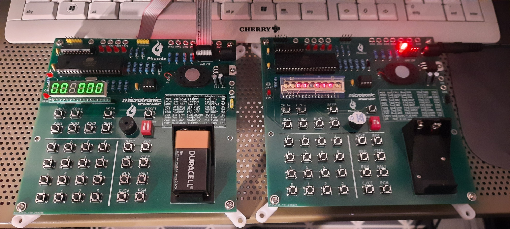

# microtronic-phoenix

## The Microtronic Phoenix Computer System - A  Microtronic Emulator Running the Original Firmware from 1981

### Jason T. Jacques: TMS1600 emulator and hardware design, refined Microtronic firmware dumping, authentic Microtronic firmware emulator running the original Microtronic firmware ROM
### Decle: TMS1xxx firmware ROM dumping technology 
### LambdaMikel: Arduino-based re-implementation of the Microtronic, first round of Microtronic firmware dumping, PCB design

Coming soon.

 

