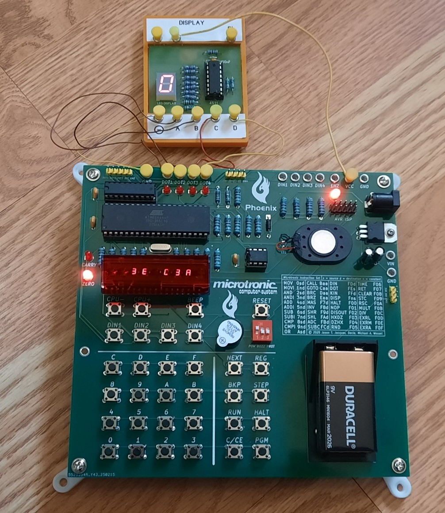
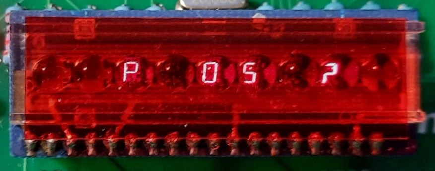
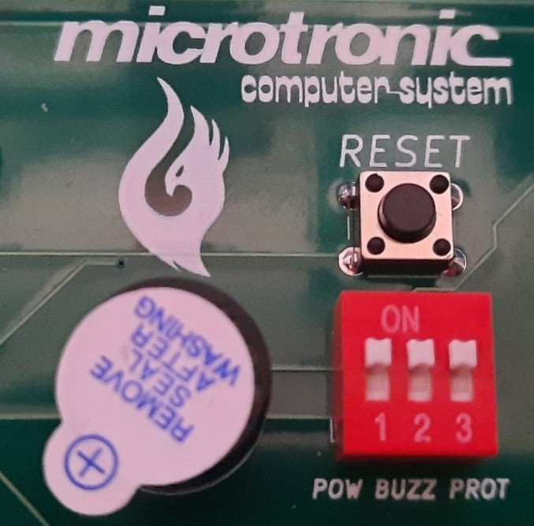
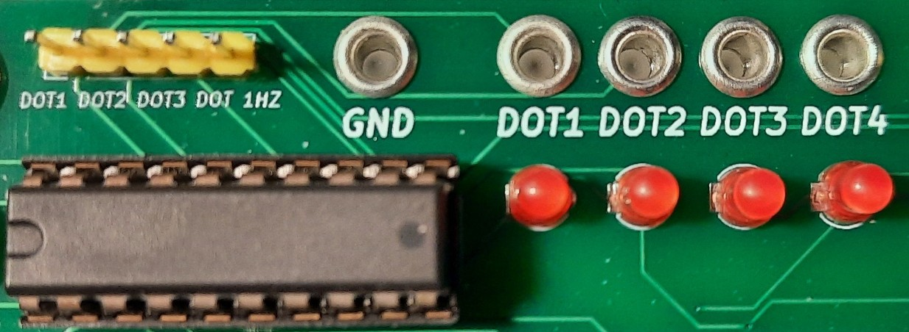

# microtronic-phoenix

## The Microtronic Phoenix Computer System - A  Microtronic Emulator Running the Original Firmware from 1981

### [Jason T. Jacques](https://jsonj.co.uk/): TMS1xxx emulator, prototype hardware design and breadboarding, refined Microtronic firmware dumping, authentic Microtronic firmware emulator running the original Microtronic firmware ROM with a TMS1600 emulator

### [Decle](https://forums.atariage.com/profile/46336-decle/): TMS1xxx firmware ROM dumping technology, TMS1xxx disassembler, expert technical advisor 

### [Michael A. Wessel](https://www.michael-wessel.info/): Arduino-based re-implementation of the Microtronic, first round of Microtronic firmware dumping, PCB design, software integration 

## About

*The *Microtronic Phoenix* represents a quantum leap in Microtronic
emulation.*

The Microtronic was an educational 4bit single-board computer system,
which was released in 1981 by the company [Busch
Modellbau](https://www.busch-modell.de) in West Germany: 


Unlike [previous hardware
emulators](https://github.com/lambdamikel/Busch-2090) of the [1981
Busch 2090 Microtronic Computer
System](https://www.busch-modell.de/information/Microtronic-Computer.aspx
), the Phoenix emulator is the first emulator that is not only a
re-implementation of the Microtronic, but actually runs the original
TMS1600 firmware from 1981.

This breakthrough was made possible by a collaboration of
[Decle](https://forums.atariage.com/profile/46336-decle/), [Jason
T. Jacques](https://jsonj.co.uk/) and [Michael
Wessel](https://www.michael-wessel.info/), referred to as "the team"
in the following.



This project is shared with the community to enable others to relive
and experience the original 1981 Busch Microtronic Computer System
in an as-authentic-as-possible way.  

## Latest News

- 08-17-2025: [Github user
`venice1200`](https://github.com/venice1200) has created a [2095
cassette interface emulator
descendant](https://github.com/lambdamikel/microtronic-2095-arduino-emulator)
that allows for direct upload of programs to the Microtronic (or
Phoenix) via an Arduino-based USB connection from the PC (no SD card
required). On the PC side, a Python script is used to transfer MIC
files directly into a Microtronic / Phoenix running the `PGM 1`
program loader. An Arduino Nano is used for the USB connection. Check
out [the project
Github](https://github.com/venice1200/Retro/tree/main/Microtronic_Phoenix)
for more details about this great project. Thanks for sharing it with the
public, `Venice1200`!


- 08-12-2025: In the meantime, a number of Makers have successfully
built their own Phoenix. I am sharing the builds of Venice and Morky
from the [Classic
Computing](https://forum.classic-computing.de/forum/index.php?thread/34844-microtronic-phoenix-edition/&pageNo=1)
Forum here:


- 04-17-2025: [Hackster.io](https://www.hackster.io/news/the-four-bit-busch-microtronic-lives-again-as-the-microtronic-phoenix-complete-with-original-rom-2a5c7ccecba7) has also featured the Microtronic Phoenix project - thanks to Gareth Halfacree!


- 04-14-2025: Phoenix in the News: [Microchip
  Makes](https://x.com/MicrochipMakes/status/1911773123323515386)
  posted about our project, and the Phoenix is also on the [Hackaday
  front page](https://www.hackaday.com) as a "Featured Project"


- 04-12-2025: All Firmware variants uploaded ("Phoenix", "Neo Only", "Phoenix Only"). 

- 02-22-2025: "Neo Only" firmware uploaded. 

## Background & Genesis

The Microtronic is powered by a mask-programmed Texas Instruments 4bit microcontroller,
the TMS1600.

Until now, an authentic Microtronic emulator was impossible as the
official firmware had been lost to history, and there was no
documented procedure for reading out ("dumping") a TMS1600 firmware
ROM. Firmware ROMs of related TMS1xxx devices (e.g., the SIMON game,
TI calculators, and the Science Fair Microcomputer Trainer) had been
retrieved in the past, but the process usually involved [destructive
die-decapping](https://seanriddle.com/decap.html).

More recently, an alternative to destructive chip decapping was
discovered for dumping the ROM of the [1985 Radio Shack Science Fair
Microcomputer
Trainer](https://hackaday.io/project/194876-exploring-the-science-fair-microcomputer-trainer).
This process utilizes an Arduino for [putting the TMS1xxx into the
so-called *test
mode*](https://hackaday.io/project/194876-exploring-the-science-fair-microcomputer-trainer/log/227981-dumping-the-tms1100),
which then allows download of the firmware ROM over a serial interface. 

After a lot of trial-and-error, the team finally succeeded in April
2024 in retrieving the Microtronic firmware ROM, hence opening up the
avenue of re-creating the original Microtronic on modern hardware. The
process is described
[here](https://hackaday.io/project/197415-microtronic-firmware-rom-archaeology)
and, much more detailed and technically accurate,
[here.](https://jsonj.co.uk/project/microtronic/)

After Decle and Michael had succeeded in enabling the TMS1600 test
mode (this process was nowhere documented on the Internet back then),
and succeeded in downloading a first version of the Microtronic ROM,
Jason then took the lead and analyzed and double checked it, corrected
some errors by hand (despite all our efforts, the retrieved firmware
still contained some ambiguity!), and, for the first time in history,
created an [ATmega-based breadboard Microtronic running the original
firmware](https://jsonj.co.uk/project/microtronic/#the-breadboard-microtronic)
on his TMS1xxx emulator!

Jason's work of curating the firmware and his TMS1xxx Microtronic
breadboard hardware emulator opened the avenue of recreating a
retro-authentic new version of the Microtronic on modern hardware,
running the original 1981 firmware ROM on a TMS1600 emulator on an
Arduino / ATmega.  **We are hence calling this new Microtronic
hardware emulator the Phoenix.**

## Phoenix Overview 

The Phoenix board uses an ATmega 644P-20U clocked at 20 MHz, a 24LC256
EEPROM, and an 74LS244 in an abundance of pre-caution for connecting
the ATmega's GPIOs to the external world of Microtronic INPUT / OUTPUT
ports.


The three different Phoenix firmwares are provided as Arduino folders
/ "sketches". See below for descriptions of these three different
variants. The [Arduino Legacy IDE IDE
1.8.19](https://www.arduino.cc/en/software) in combination with
[MightyCore](https://github.com/MCUdude/MightyCore) are used for
firmware compilation and uploading onto the Phoenix board over the ISP
header (see below).

One can either use an original 6digit 7segment (or really 8segment if
we include the individual decimal dots for each digit) TIL 393-6
retro-authentic bubble LED display from Texas Instruments, or the NSA
1166 from National Semiconductors as shown in the above picture. As
these are hard to come by, it is also possible to use a CL3061AG or
SH3661AS modern LED display and an adapter (provided here as well): 


## Original Microtronic Firmware

The original Microtronic firmware can be found [here](microtronic-firmware/).

The files are provided for reference and interest only, and are not
required for programming the Phoenix firmware. The Phoenix firmware
sketches are self-contained, and the [Microtronic firmware ROM
image](microtronic-firmware/microtronic.bin) is embedded on the
code-level (instead of on the file level) in them.

## Emulation Modes - NEO vs. PHOENIX 

The Phoenix offers two Microtronic emulation modes:

- the **Neo Mode** is based on [Michael's Arduino-based re-implementations of the Microtronic
in C](https://github.com/lambdamikel/Busch-2090), 
and similar in spirit to the [Retro-Authentic Bubble LED Display Microtronic.](https://hackaday.io/project/180252-a-retro-authentic-microtronic-rc-202110-winner) 
- the **Phoenix Mode** is based on [Jason's breadboard Microtronic running the original Microtronic ROM on his TMS1xxx emulator.](https://jsonj.co.uk/project/microtronic/#the-breadboard-microtronic)

The Phoenix is offered with *three different firmwares:*

- [Neo Only:](microtronic-phoenix-neo-only/) only offer the Neo Mode
  (describe below).

- [Phoenix Only:](microtronic-phoenix-only/) only offer the Phoenix
  Mode (described below).

- [Combined:](microtronic-phoenix/) **should be the default**; this
offers both modes; upon boot or reset (via the `RESET` button), the
user can select the firmware of choice for the "**P**hoenix **OS**" -
"**P OS ?**"; here, push **1** for NEO, and **2** for PHOENIX:

  

### Common Hardware Features

The Phoenix board offers a number of additional hardware features, in
particular, an on-board buzzer, and 4 additional push buttons `DIN1`
to `DIN4`. 


The original Microtronic came with a buzzer as well as two push button
("G" and "H") which, in many experiments, where connected to the
digital inputs (DIN), and the buzzer was usually connected to either
DOT Output 1 or 4, as shown in this picture: 

 

The Phoenix board hence offers these on-board, for convenience (plus
two extra-buttons, `DIN3` and `DIN4`). The on-board buzzer can also be
disconnected via the `BUZZ` DIP switch.

Moreover, both the Neo and Phoenix mode support the CPU speed buttons:
emulation speed can be decreased (`CPU-`) and increased ( `CPU+`). The
`RESET` button works in both firmwares as well: 

 

### Neo Mode

In Neo Mode, the hardware emulator has access to the additional
hardware features on the board: 

- a **speaker** for sound output: like in previous Microtronic
emulator versions, [vacuous op-codes are used as sound
op-codes.](https://github.com/lambdamikel/Busch-2090?tab=readme-ov-file#emulator-sound-output-and-sound-instructions)

  

- an 256 kBit 24LC256 **EEPROM** for mass-storage of Microtronic RAM
  dumps, instead of the 2095 cassette interface. The EEPROM has enough
  space for 42 complete memory dumps. It is accessed via `PGM 1` and
  `PGM 2`. **NOTE: to save to or load from the EEPROM, the `PROT`ect
  switch must be in OFF position!**. Turn the `PROT`ect switch back on
  after EEPROM operation. See this picture:

  

  **Please note that the `CARRY` LED will not work properly with the
  `PROT` switch in OFF position.**

- the speaker is also used for key beeps; the `BEEP` button is used to
  turn on or off key beeps.

- 7segment status display: with a suitable 7segment LED display that
offers controll over the individual digit decimal dots (the NSA 1166
from National Semiconductors does not, but the TIL 393-6 from TI
does), the 6digit 7segment display also indicates the CPU emulator
state, as well as the `CARRY`, `ZERO`, and `1 Hz` CLOCK flags (in
addition to the LEDs on the board). The `BEEP` button is used to turn
on or off this status display - this is a feature which is independent
of the display's main function as the primary visual user interface. 

   

  The status decimal dot LEDs are, from left to right: 
  - Dot on digit 6: program running
  - Dot on digit 5: requesting user input (`KIN` active) 
  - Dot on digit 4: breakpoint active (`BKP`) 
  - Dot on digit 3: `CARRY` flag
  - Dot on digit 2: `ZERO` flag  
  - Dot on digit 1: `1 Hz` clock

  The NSA 1166 only supports control of the decimal dot for digit 3;
  hence, only the `CARRY` flag can be visualized with it.

  It should again be noted that, if in OFF position, the `PROT`ect
  switch disables the main `CARRY` flag LED (left to the 7segment
  display). However, utilizing the second `CARRY` flag indicator (the
  decimal dot of digit 3) we can hence leave the `PROT`ect switch in a
  permanent OFF position without loosing `CARRY` flag visibility. And,
  this also works with the NSA 1166.
  
  Also note that two NSA 1166 / TIL 393-6 adapters are provided in this
repo (see picture above): one for the [CL3061AG display](gerbers/gerbers-til-display-adapter.zip), and one for the [SH3661AS diplay](gerbers/gerbers-til-display-adapter2.zip). The bubble LED display are getting very hard to source these days.    

The Neo firmware contains the following `PGM` programs; these are: 

- ``PGM 1`` : Load program from EEPROM
- ``PGM 2`` : Save program to EEPROM 
- ``PGM 3`` : Set clock 
- ``PGM 4`` : Show clock 
- ``PGM 5`` : Clear memory
- ``PGM 6`` : Load ``F01`` (NOPs) into memory 
- ``PGM 7`` : Nim Game 
- ``PGM 8`` : Towers of Hanoi (up to 4 disks - see https://github.com/lambdamikel/towers-of-hanoi) 
- ``PGM 9`` : Electronic Die (Microtronic Manual Vol. 1, page 10) 
- ``PGM A`` : Three Digit Counter (Microtronic Manual Vol. 1, page 19) 
- ``PGM B`` : Moving LED Light (Microtronic Manual Vol. 1, page 48) 
- ``PGM C`` : Digital input DIN Test Program
- ``PGM D`` : Lunar Lander (Moon Landing) Game (Microtronic Manual Vol. 1, page 23) 
- ``PGM E`` : Prime Numbers ("Computerspiele 2094", page 58) 
- ``PGM F`` : 17+4 BlackJack Game ("Computerspiele 2094", page 32) 

Note that, on the original Microtronic and hence in Phoenix mode, `PGM
0` performs a self-test, and `PGM 1` and `PGM 2` are used to access
the 2095 Cassette Interface, which is currently not supported by the
Phoenix board. Instead, `PGM 1` and `PGM 2` are used to access
the EEPROM. 

Moreover, there are no `PGM` demo programs `8` to `F` in Phoenix mode.

### Phoenix Mode

In this mode the system behaves identical to the original Busch
Microtronic, executing the original Microtronic firmware using Jason's
TMS1600 emulator! Hence, [the original Busch
manuals](https://github.com/lambdamikel/Busch-2090/tree/master/manuals)
are the best documentation. It is currently only available in German,
but contemporary GenAI technology will likely have little problems
translating it to English.

Note that the **Phoenix runs ~ 30 to 40 % faster than the original
Microtronic,** but still **significantly slower than in Neo mode at
max speed.**

The digital inputs and outputs are fully functional, and even the
original `PGM 1` and `PGM 2` firmware ROM programs are working.
They can be used for accessing the [2095 cassette interface
emulator.](https://github.com/lambdamikel/microtronic-2095-arduino-emulator)
Here is [a video demonstrating operation of the original 2095 cassette
interface](https://youtu.be/7KmG64e4DPE), and [a 2095 emulator
tutorial by "Mein Elektronic Hobby" (in
German)](https://youtu.be/0MPBtOWTzlk) for first steps with
`PGM 1` and `PGM 2`.

Moreover, unlike the Neo version, the self-check `PGM 0` firmware ROM
program is functional, and can be used for checking proper operation
of the system, see [User Manual Vol. 1, pp. 5 -
6](https://github.com/lambdamikel/Busch-2090/blob/master/manuals/anl2090-1.pdf])
(note that a test harness is required for `PGM 0` operation).

Please note that the `RESET` button is supported, but **the `CPU-`,
`CPU+`, and `BEEP` buttons are non-functional in this mode. They only
work in Neo mode.**

### Combined Mode

**This should be considered the default firmware - it combines the features
of the Neo and the original firmware.** 

In addition to the individual features of the Phoenix and Neo modes as
just described, the combined mode realizes one more *essential
synergistic feature* making this mode more than the sum of its
individual modes: **shared Microtronic program memory!** In this
way, the Phoenix mode can take advantage of the additional features
of the Neo mode, like EEPROM access or additional PGM demo programs. 

For example, to load a program from EEPROM into Phoenix, we would

1. start in Neo mode, load a Microtronic program from EEPROM via `PGM 1`.
2. switch to Phoenix mode: push `RESET`, enter `2`.
3. the same program is now available in Phoenix mode.

In general, all changes made to the current Microtronic program in memory
will always be available to the other mode as well. 

You can also load one of the additional demo `PGM`s easily into Phoenix mode.

1. start in Neo mode, load a `PGM` ROM program, for example, "17Add4 Blackjack":
`HALT-PGM-F`. 
2. switch to Phoenix mode: push `RESET`, enter `2`.
3. play Blackjack in Phoenix mode: `HALT-NEXT-0-0-RUN`. 


## The Phoenix Board

In principle, the Phoenix is a one-chip design - everything is driven
by the ATmega 644P-20U, even the display. The 24LC256 EEPROM is
optional; the machine will also work without it. The 74LS244 is used
to electrically decouple the Microtronic inputs and outputs from the
ATmega and make it more robust for experimentation in case an
experiment goes awry. It is cheaper and easier to replace the 74LS244
than the ATmega.

### Phoenix Power Supply Options 

There are four options of powering the Phoenix board: 

 

1. With a 9V block battery. The power switch must be in ON position.

2. With an external 9V to 15V DC power supply over the standard
center-positive 2.5 mm power jack. A 0.5A supply is sufficient.
The power switch must be in ON position. 

3. Over the `VIN` and `GND` rivet sockets. The power switch must be in ON
position.

4. Over the AVR ISP header. **In this case, the power switch should be
in OFF position!**

 

For options 1 to 3, a 7805 voltage regulator is used to down-regulate
the input voltage to the required 5V level.

Note that it is not necessary to remove the 9V battery from the
Phoenix if another power supply option is used - a standard 1N4001
rectifier diode prevents all current flow (and hence "charging"
attempts) into the 9V battery from the external power supply.

### Phoenix `VCC`, `VIN`, and `GND` Outputs

For powering electronics experiments with Busch electronics kits
and/or breadboards, the Phoenix board can supply 5V via `VCC` as well
as 9V from the battery (or any voltage that the external power supply
provides) via `VIN`. The power switch must be in ON position to access
these voltages. Both `VCC` and `VIN` are available from rivet sockets
as well as pin headers.

 

### Display & Flags

The 6digit 7segment LED display is the primary visual output channel
of the Microtronic. It should be fitted with a red (or green) lens
filter to enhance the contrast.

Left of the display are the `CARRY` and `ZERO` flags.  Note that the
`CARRY` LED will only function if the `PROT`ect DIP switch is on `ON`
position. However, the NEO mode can utilize the decimal dot of the
third display digit from the right to visualize the `CARRY` flag as
well.

 

### Inputs & Outputs

The Microtronic input and output ports are available in two form form
factors: as pin headers for DuPont cables (breadboard friendly), and
via classical Busch metal rivet sockets for the little yellow
connector pegs:

 

These are the Microtronic outputs (they are controlled via the `DOT` = 
Data Out op-code); note that `GND` is available via a rivet socket,
and the `1 Hz` clock signal from the pin header:



There are LEDs for the 4 Microtronic outputs, as well as an LED for
the `1 Hz` clock output. 

The Microtronic inputs (they can be read with the `DIN` = Data In
op-code) are available as pin headers and rivet sockets as well; also
note the `1 Hz` clock rivet and corresponding LED, as well as the
power supply socket rivets for external circuits / experiments:


### Additional Hardware Features

The additional hardware features of the board have already been
discussed: the buzzer, the speaker, and the `DIN1` to `DIN4`
buttons. The buzzer can be switched off with the `BUZZ` DIP switch.


### Phoenix and the 2095 SD Card-Based Cassette Interface Emulator 

The hardware emulation of the Phoenix is faithful enough to allow
interfacing with the [2095 cassette interface
emulator](https://github.com/lambdamikel/microtronic-2095-arduino-emulator).
Despite the availability of the much more comfortable EEPROM for
program storage, this is of some practical utility, as `.MIC` programs
can be loaded from and stored to SD card, and the FAT32 file system
facilitates convenient data exchange with the PC or Mac. Programs in
`.MIC` format can be found
[here](https://github.com/lambdamikel/Busch-2090/tree/master/software),
and loaded into the machine with the 2095 emulator, and then stored to
EEPROM as well, saving the user from having to type these in.

 

Unfortunately, it is not possible to use [the real 2095 interface and
cassette recorder](https://youtu.be/7KmG64e4DPE), as Phoenix does not
generate the required 32.768 kHz clock signal that is the basis for
the tone generation that encode the 0 and 1 bits via [Frequency Key
Shifting](https://en.wikipedia.org/wiki/Frequency-shift_keying) on the
2095. The 2095 schematics - reconstructed by Frank de Jaeger - can be found
[here](https://www.rigert.com/ee-forum/download/file.php?id=5890);
there we can see that the 32.678 kHz signal generated by the
Microtronic provides the Phi1 clock signal to a [CD4060 14-Stage
Ripple-Carry Binary
Counter/Oscillator.](https://www.ti.com/lit/ds/symlink/cd4060b.pdf?ts=1741189915408&ref_url=https%253A%252F%252Fwww.google.com%252F)

### Bill of Material - BOM

- U1: ATmega 644P-20U + 40 Pin DIP Socket, 20 Mhz crystal and matching capacitors (2x 22 pF)
- U3: 74LS244 + 20 Pin DIP Socket 
- U4: 7805 + matching capacitors (e.g., 2x 22 uF electrolytic) 
- U6 (optional): 24LC256 + 8 Pin DIP Socket 
- DOT1-DOT4, CARRY, ZERO, 1HZ: 3mm diffused red LED of your choice, e.g., https://www.amazon.com/dp/B0DN1LXQYH
- 1N4001 Rectifier Diode 
- R1..R4: 4.7 k 
- R5..R9: 1 k - these should match the DOT1-DOT4 and 1HZ LEDs; for modern low-power LEDs such as the ones linked above, 1 k is quite bright (4.7 k might be better)
- R10..R11: 1 k - these should match the CARRY and ZERO LEDs; for modern low-power LEDs such as the ones linked above, 1 k is quite bright (4.7 k might be better)
- R12: 100 Ohm - should match the buzzer (reduces volume) 
- R13: 75 Ohm - should match the loudspeaker (reduces volume)
- R14..R20, R22 : 1 k - shold match the LED display 
- R21: 10 k
- Speaker (optional): https://www.amazon.com/dp/B07LGKSRCK
- Buzzer (optional): https://www.amazon.com/dp/B01N7NHSY6
- 3-Position DIP Switch: https://www.amazon.com/dp/B0CSN9XDG5
- 5.5x2.1 Barrel Power Jack: https://www.amazon.com/dp/B081DYQSC9
- 6x6x5 Push Buttons: https://www.amazon.com/dp/B01CGMP9GY
- 6digit 7segment LED display with Common Cathode: https://www.aliexpress.us/item/3256803561087338.html, or TI TIL 393, NSA 1166
- 3x 103 (100 nF) capacitors (or 3x 104 / 1 uF - doesn't matter that much: https://hackaday.com/2025/01/25/capacitor-decoupling-chaos-and-why-you-should-abandon-100-nf/)
- breakable PIN headers, 2.54 mm pitch: https://www.amazon.com/HiLetgo-20pcs-2-54mm-Single-Header/dp/B07R5QDL8D
- 9V battery holder box: https://www.amazon.com/dp/B07Q1N2MHT
- Metal rivets: https://www.digikey.com/en/products/detail/keystone-electronics/46/316215
- M2 screws + nuts + washers: https://www.amazon.com/dp/B0BX96SMW4
- Mounting feet: https://www.amazon.com/dp/B07DHHS1Q8
- USPasp: https://www.amazon.com/dp/B0885RKVMC
- Heatsinks for the 7805 (optional): https://www.amazon.com/dp/B0CG91KN14


### Gerbers

The Gerbers for the Phoenix board


and for the display adapter 


are available:

- [Phoenix board](gerbers/gerbers-phoenix4.zip)
- [Adapter for CL3061Ax displays](gerbers/gerbers-til-display-adapter.zip)
- [Adapter for SG3661Ax displays](gerbers/gerbers-til-display-adapter2.zip)

## Phoenix Firmwares 

The firmware requires the Arduino IDE and a proper installation of 
[MightyCore](https://github.com/MCUdude/MightyCore).

Firmware uploading / programming is done "in system" via the ATmega
ISP header and, for example,
[USBasp](https://www.amazon.com/dp/B0885RKVMC):
 


Note that you will need to burn the bootloader with the correct
MightyCore settings first before you can compile and upload the `.ino`
Arduino sketch for the firmware variant of your choice (Combined,
Neo Only, or Phoenix Only, as described above): 

 


Please note that you will need to [install the `NewTone` library from
Tim
Eckel.](https://bitbucket.org/teckel12/arduino-new-tone/wiki/Home); a
copy is included [here](microtronic-phoenix-neo-only/NewTone/) for
convenience.

The 7segment LED glyphs / fonts are [Ricardo Batista's
TM16xxFonts.h](https://github.com/maxint-rd/TM16xx/blob/master/src/TM16xxFonts.h); 
a copy is included [here](microtronic-phoenix-neo-only/TM16XXFonts.h) for convenience. 

## Microtronic Software 

A great new fun Microtronic software project is the "Monarch" rotary
slot machine by [rab-berlin](https://github.com/rab-berlin): 

[https://github.com/rab-berlin/Monarch2090](https://github.com/rab-berlin/Monarch2090)

Moreover, most of the historical Microtronic programs from the
Microtronic manuals can be found
[here](https://github.com/lambdamikel/Busch-2090/tree/master/software),
in `.MIC` format.

Michael has [some Microtronic programming videos
online](https://www.youtube.com/watch?v=7hjPqXKYwDc&list=PLvdXKcHrGqhe_Snxh4nh8RMDz2SiUDCHH);
the highlight is an implementation of a [recursive version of the
infamous "Towers of Hanoi" (yes, recursion on the Microtronic is
possible!)](https://github.com/lambdamikel/towers-of-hanoi).


## Acknowledgements

This project benefitted tremendously from the following individuals; we are very grateful for your
contributions to this project! In particular, 

- Jörg Vallen: 

  The [co-designer of the Busch
  Microtronic](https://github.com/lambdamikel/Busch-2090/blob/master/manuals/joerg-vallen-diplom.pdf),
  author of [the Microtronic
  manuals](https://github.com/lambdamikel/Busch-2090/tree/master/manuals),
  and CEO of [Busch Modellbau](https://www.busch-modell.de),
  **Mr. Jörg Vallen**, was very supportive and encouraging of this as
  well as past Microtronic-related projects - not only allowed he to
  include the [original Microtronics
  manuals](https://github.com/lambdamikel/Busch-2090/tree/master/manuals)
  and
  [schematics](https://github.com/lambdamikel/Busch-2090/blob/master/manuals/microtronic.jpg),
  but he also gave us permission to publish the [firmware
  ROM](https://cdn.hackaday.io/files/1974158446203360/microtronic-81-47.bin.bin)
  and [firmware
  disassembly](https://cdn.hackaday.io/files/1974158446203360/really-final-microetronic-firmware-disassembled.txt)
  as well (disassembled by Decle's TMS1xxx disassembler and
  hand-corrected by Jason) - **THANK YOU:**

  ```
    Von: Jörg Vallen <....@busch-model.com>
    Gesendet: Freitag, 21. Juni 2024 10:37 An: 'Michael Wessel' <.....@gmail.com>
    Betreff: AW: Neues Microtronic-Video aus dem Saarland

    Sehr geehrter Herr Wessel,  

    ...
    
    Finde ich genial, dass Sie auch das Betriebssystem
    ausgelesen haben. Natürlich dürfen Sie gerne das Betriebssystem
    auf der Microtronic-Github-Seite veröffentlichen

    ...

    Ihnen alles Gute und weiter erfolgreiches microtronicen…

    Viele Grüße Jörg Vallen
    ``` 
    
- Third-party Arduino libraries: 
    - [The `TM16XXFonts.h` by Ricardo Batista.](https://github.com/maxint-rd/TM16xx/blob/master/src/TM16xxFonts.h)
    - [The `NewTone` library by Tim Eckel.](https://bitbucket.org/teckel12/arduino-new-tone/wiki/Home)

- [**Contributors to the Microtronic Neo predecessors**](https://github.com/lambdamikel/Busch-2090) include:
    - Frank de Jaeger: 2nd Generation Microtronic PCB
    - Manfred Henf: 2nd Generation Microtronic 3D Design & Printing
    - Martin Sauter: Busch 2095 Cassette Interface Protocol Reengineering & Research
    - Lilly (https://github.com/ducatimaus/Busch-2090): Breakpoint & Single Stepping Integration for Uno R3 Version
    - [Björn Rathje](https://github.com/rab-berlin): `HXDZ` op-code bug fix (overflow set to 0 behavior), `DISP` op-code bugfix


- The YouTube channel ["Mein Elektronik Hobby"](https://www.youtube.com/channel/UCEZvUvlcCfJW8mjxwGM8-jw),
  who demonstrated [PicoRAM-2090](https://www.youtube.com/watch?v=267T5BnslIs)
  (also see [https://github.com/lambdamikel/picoram2090](https://github.com/lambdamikel/picoram2090))
  as well as the [2095 Tape Interface / Tape Emulator](https://youtu.be/0MPBtOWTzlk) (joint work
  with Martin Sauter).


**Thank you all!**