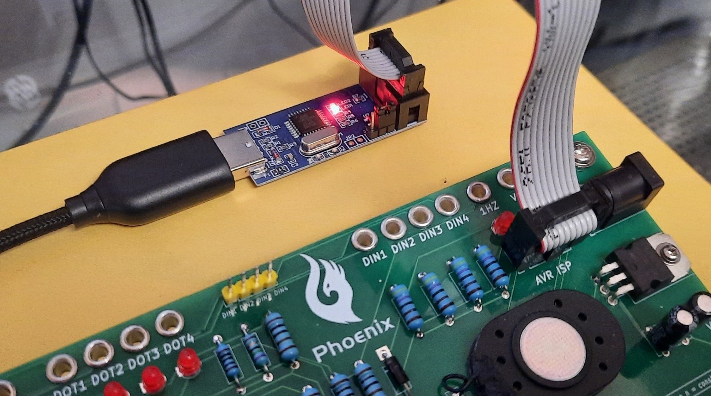

# microtronic-phoenix

## The Microtronic Phoenix Computer System - A  Microtronic Emulator Running the Original Firmware from 1981

### [Jason T. Jacques](https://jsonj.co.uk/): TMS1xxx emulator, prototype hardware design and breadboarding, refined Microtronic firmware dumping, authentic Microtronic firmware emulator running the original Microtronic firmware ROM with a TMS1600 emulator

### [Decle](https://forums.atariage.com/profile/46336-decle/): TMS1xxx firmware ROM dumping technology, TMS1xxx disassembler, expert technical advisor 

### [Michael A. Wessel](https://www.michael-wessel.info/): Arduino-based re-implementation of the Microtronic, first round of Microtronic firmware dumping, PCB design, software integration 

## About

The *Microtronic Phoenix* represents a quantum leap in Microtronic
emulation. Unlike [previous hardware
emulators](https://github.com/lambdamikel/Busch-2090) of the [1981
Busch 2090 Microtronic Computer
System](https://www.busch-modell.de/information/Microtronic-Computer.aspx
), the Phoenix emulator is the first emulator that is not only a
re-implementation of the Microtronic, but actually runs the original
TMS1600 firmware from 1981.

This breakthrough was made possible by a collaboration of
[Decle](https://forums.atariage.com/profile/46336-decle/), [Jason
T. Jacques](https://jsonj.co.uk/) and [Michael
Wessel](https://www.michael-wessel.info/), referred to as "the team"
in the following.

## Background & Genesis

The Microtronic is powered by a mask-programmed Texas Instruments 4bit microcontroller,
the TMS1600.

So far, an authentic Microtronic emulator was impossible as the
official firmware had been lost to history, and there was no
documented procedure for reading out ("dumping") a TMS1600 firmware
ROM. Firmware ROMs of related TMS1xxx devices (e.g., the SIMON game,
TI calculators, and the Science Fair Microtroncoller Trainer) had
been retrieved in the past, but the process usually involved
[destructive die-decapping](https://seanriddle.com/decap.html).

More recently, an alternative to destructive chip decapping was
discovered for dumping the ROM of the [1985 Radio Shack Science Fair
Microcomputer
Trainer](https://hackaday.io/project/194876-exploring-the-science-fair-microcomputer-trainer).
This process utilizes an Arduino for [putting the TMS1xxx into the
so-called *test
mode*](https://hackaday.io/project/194876-exploring-the-science-fair-microcomputer-trainer/log/227981-dumping-the-tms1100),
which then allows download of the firmware ROM over a serial interface. 

After a lot of trial-and-error, the team finally succeeded in April
2024 in retrieving the Microtronic firmware ROM, hence opening up the
avenue of re-creating the original Microtronic on modern hardware. The
process is described
[here](https://hackaday.io/project/197415-microtronic-firmware-rom-archaeology)
and, much more detailed and technically accurate,
[here.](https://jsonj.co.uk/project/microtronic/)

After Decle and Michael had succeeded in enabling the TMS1600 test
mode (this process was nowhere documented on the Internet back then),
and succeeded in downloading a first version of the Microtronic ROM,
Jason then took the lead and analyzed and double checked it, corrected
some errors by hand (despite all our efforts, the retrieved firmware
still contained some ambiguity!), and, for the first time in history,
created an [ATmega-based breadboard Microtronic running the original
firmware](https://jsonj.co.uk/project/microtronic/#the-breadboard-microtronic)
on his TMS1xxx emulator!

Jason's work of curating the firmware and his TMS1xxx Microtronic
breadboard hardware emulator opened the avenue of recreating a
retro-authentic new version of the Microtronic on modern hardware,
running the original 1981 firmware ROM on a TMS1600 emulator on an
Arduino / ATmega.  **We are hence calling this new Microtronic
hardware emulator the Phoenix.**

This project is shared with the community to enable them to relive
and experience the original 1981 Busch Microtronic Computer System
in an as-authentic-as-possible way.  


The Phoenix board uses an ATmega 644P-20U clocked at 20 MHz, a 24LC256 
EEPROM, and an 74LS244 in an abundance of pre-caution for connecting
the ATmega's GPIO's to the external work of Microtronic INPUT / OUTPUT
ports.

One can either use an original 6digit 7segment (or really 8segment if
we include the individual decimal dots for each digit) TIL 393-6
retro-authentic bubble LED display from Texas Instruments, or the NSA
1166 from National Instruments as shown in the above picture. As these are
hard to come by, it is also possible to use a CL3061AG modern LED display
and an adapter (provided here as well):


## Emulation Modes - NEO vs. PHOENIX 

The Phoenix offers two Microtronic emulation modes:

- the **Neo Mode** is based on [Michael's Arduino-based re-implementations of the Microtronic
in C](https://github.com/lambdamikel/Busch-2090), 
and similar in spirit to the [Retro-Authentic Bubble LED Display Microtronic.](https://hackaday.io/project/180252-a-retro-authentic-microtronic-rc-202110-winner) 
- the **Phoenix Mode** is based on [Jason's breadboard Microtronic running the original Microtronic ROM on his TMS1xxx emulator.](https://jsonj.co.uk/project/microtronic/#the-breadboard-microtronic)

The Phonix is offered with *three different firmwares:*

- Neo Only: only
offer the Neo Mode (described below).

- Phoenix Only: only offer the Phoenix Mode (described below).

- Combined: offer both modes; upon boot or reset (via the `RESET`
button), the user can select the firmware of choice by answering
the question for the "**P**hoenix **OS**", **P OS ?**.

  **Push 1 for NEO, and 2 for PHOENIX:**

  

### Common Hardware Features

The Phoenix board offers a number of additional hardware features, in
particular, an on-board buzzer, and 4 additional push buttons `DIN1`
to `DIN4`. 


The original Microtronic came with a buzzer as well as two push button
("G" and "H") which, in many experiments, where connected to the
digital inputs (DIN), and the buzzer was usually connected to either
DOT Output 1 or 4, as shown in this picture: 

 

The Phoenix board hence offers these on-board, for convenience (plus
two extra-buttons, `DIN3` and `DIN4`). The on-board buzzer can also be
disconnected via the `BUZZ` DIP switch: 


### Neo Mode

In Neo Mode, the hardware emulator has access to the additional
hardware features on the board: the speaker and EEPROM: - a speaker
for sound output: like in previous Microtronic emulator versions,
[vacuous op-codes are used as sound
op-codes.](https://github.com/lambdamikel/Busch-2090?tab=readme-ov-file#emulator-sound-output-and-sound-instructions)

  

- an 256 kBit 24LC256 EEPROM for mass-storage of Microtronic RAM dumps, instead of the 2095 cassette interface. The EEPROM has enough space for 42 complete memory dumps. It is accessed via PGM 1 and PGM 2. **NOTE: to save to or load from the EEPROM, the `PROT` switch must be in OFF position!**. Turn the `PROT` switch back on after the EEPROM operation. See this picture:

  

- the speaker is also used for key beeps; the `BEEP` button is used to turn on or off
  key beeps. 

- 7segment status display: with a suitable 7segment LED display that
offers controll over the individual digit decimal dots (the NSA 1166
from National Instruments does not, but the TIL 393-6 from TI does),
the 6digit 7segment display also indicates the CPU emulator state, as
well as the CARRY, ZERO, and 1 HZ CLOCK flags (in addition to the LEDs
on the board). The `BEEP` button is used to turn on or off this status
display; note that this is of course an indepenent feature of the
display which is independent of its main user interface role in the
Microtronic (no control of the decimal points with Microtronic
instructions is possible, and there are no floating point numbers either). 

   

  The status LEDs are, from left to right:
  - program running 
  - requesting user input (`KIN` active)
  - breakpoint active (`BKP`) 
  - CARRY flag
  - ZERO flag  
  - 1 Hz clock

  Also note that [the NSA 1166 / TIL 393-6 adapter
PCB](gerbers/gerbers-til-display-adapter.zip) shown in the above
picture is provided in this repo, which allows you to use a modern
CL3061AG instead of the retro-authentic NSA 1166 or TIL 393-6 which
are getting very hard to source these days.

The Neo firmware contains the following `PGM` programs; these are: 

- ``PGM 1`` : restore emulator memory from EEPROM ("core restore") 
- ``PGM 2`` : store / dump emulator memory to EEPROM  ("core dump") 
- ``PGM 3`` : set clock 
- ``PGM 4`` : show clock 
- ``PGM 5`` : clear memory
- ``PGM 6`` : load ``F01`` (NOPs) into memory 
- ``PGM 7`` : Nim Game 
- ``PGM 8`` : Crazy Counter 
- ``PGM 9`` : the Electronic Dice, from Microtronic Manual Vol. 1, page 10
- ``PGM A`` : the Three Digit Counter from Microtronic Manual Vol. 1, page 19 
- ``PGM B`` : moving LED Light from the Microtronic Manul Vol. 1, page 48  
- ``PGM C`` : digital input DIN Test Program
- ``PGM D`` : Lunar Lander (Moon Landing) from the Microtronic Manual Vol. 1, page 23 
- ``PGM E`` : Prime Numbers, from the "Computerspiele 2094" book, page 58
- ``PGM F`` : Game 17+4 BlackJack, from the "Computerspiele 2094" book, page 32

Note that, on the original Microtronic and hence in the Phoenix mode (!),
`PGM 0` performs a self-test, and `PGM 1` and `PGM 2` are used to access the 2095
Cassette Interface, which is currently not supported by the Phoenix board.

Moreover, there are no `PGM` demo froms `8` to `F`. 

### Phoenix Mode

tbd 


### Combined Mode 

In addition to the individual features of the Phoenix and Neo modes as
just described, the combined mode realizes one more *essential
synergistic feature* making this mode more than the sum of its
individual modes: **shared Microtronic program memory!** In this
way, the Phoenix mode can take advantage of the additional features
of the Neo mode, like EEPROM access or additional PGM demo programs. 

For example, to load a program from EEPROM into Phoenix, we would

1. start in Neo mode, load a Microtronic program from EEPROM via `PGM 1`.
2. switch to Phoenix mode: push `RESET`, enter `2`.
3. the same program is now available in Phoenix mode.

In general, all changes made to the current Microtronic program in memory
will always be available to the other mode as well. 

You can also load one of the additional demo `PGM`s easily into Phoenix mode.

1. start in Neo mode, load a `PGM` ROM program, for example, "17Add4 Blackjack":
`HALT-PGM-F`. 
2. switch to Phoenix mode: push `RESET`, enter `2`.
3. play Blackjack in Phoenix mode: `HALT-NEXT-0-0-RUN`. 


## The Phoenix Board

tbd

### Bill of Material - BOM

tbd

### Gerbers

The Gerbers for the Phoenix board


and for the display adapter 


are available:

- [Phoenix board](gerbers/gerbers-phoenix4.zip)
- [Display adapter](gerbers/gerbers-til-display-adapter.zip)


## The Firmwares 

The firmware requires the Arduino IDE and a proper installation of 
[MightyCore](https://github.com/MCUdude/MightyCore).

Programming is done "in system" via the ATmega ISP header:
[USBasp](https://www.amazon.com/dp/B0885RKVMC): 
 


Note that you will need to burn the bootloader with the correct
MightyCore settings first before you can compile and upload the `.ino`
Arduino sketch for the firmware variant of your choice (Combined,
Neo Only, or Phoenix Only, as described above): 

 


## Microtronic Software 

A great new fun Microtronic software project is the re-implementation
of the Monarch one-armed bandit / rotary slot machine "Monarch" by
[rab-berlin](https://github.com/rab-berlin): 

[https://github.com/rab-berlin/Monarch2090](https://github.com/rab-berlin/Monarch2090)

Moreover, most of the [historical Microtronic programs can be found
here](https://github.com/lambdamikel/Busch-2090/tree/master/software), in `.MIC` format.

Michael has [some Microtronic programming videos
online](https://www.youtube.com/watch?v=7hjPqXKYwDc&list=PLvdXKcHrGqhe_Snxh4nh8RMDz2SiUDCHH);
the highlight is an implementation of a [recursive version of the
infamous "Towers of Hanoi" (yes, recursion on the Microtronic is
possible!)](https://github.com/lambdamikel/towers-of-hanoi).


## Acknowledgements

This project benefitted tremendously from the following individuals; we are very grateful for your
contributions to this project! In particular, 

- Jörg Vallen: 

  The [co-designer of the Busch
  Microtronic](https://github.com/lambdamikel/Busch-2090/blob/master/manuals/joerg-vallen-diplom.pdf),
  author of [the Microtronic
  manuals](https://github.com/lambdamikel/Busch-2090/tree/master/manuals),
  and CEO of [Busch Modellbau](https://www.busch-modell.de),
  **Mr. Jörg Vallen**, was very supportive and encouraging of this as
  well as past Microtronic-related projects - not only allowed he to
  include the [original Microtronics
  manuals](https://github.com/lambdamikel/Busch-2090/tree/master/manuals)
  and
  [schematics](https://github.com/lambdamikel/Busch-2090/blob/master/manuals/microtronic.jpg),
  but he also gave us permission to publish the [firmware
  ROM](https://cdn.hackaday.io/files/1974158446203360/microtronic-81-47.bin.bin)
  and [firmware
  disassembly](https://cdn.hackaday.io/files/1974158446203360/really-final-microetronic-firmware-disassembled.txt)
  as well (disassembled by Decle's TMS1xxx disassembler and
  hand-corrected by Jason) - **THANK YOU:**

  ```
    Von: Jörg Vallen <....@busch-model.com>
    Gesendet: Freitag, 21. Juni 2024 10:37 An: 'Michael Wessel' <.....@gmail.com>
    Betreff: AW: Neues Microtronic-Video aus dem Saarland

    Sehr geehrter Herr Wessel,  

    ...
    
    Finde ich genial, dass Sie auch das Betriebssystem
    ausgelesen haben. Natürlich dürfen Sie gerne das Betriebssystem
    auf der Microtronic-Github-Seite veröffentlichen

    ...

    Ihnen alles Gute und weiter erfolgreiches microtronicen…

    Viele Grüße Jörg Vallen
    ``` 
    

- [**Contributors to the Microtronic Neo predecessors**](https://github.com/lambdamikel/Busch-2090) include:
    - Frank de Jaeger: 2nd Generation Microtronic PCB
    - Manfred Henf: 2nd Generation Microtronic 3D Design & Printing
    - Martin Sauter: Busch 2095 Cassette Interface Protocol Reengineering & Research
    _ Lilly (https://github.com/ducatimaus/Busch-2090): Breakpoint & Single Stepping Integration for Uno R3 Version
    - [Björn Rathje](https://github.com/rab-berlin): `HXDZ` op-code bug fix (overflow set to 0 behavior), `DISP` op-code bugfix


- The YouTube channel ["Mein Elektronik Hobby"](https://www.youtube.com/channel/UCEZvUvlcCfJW8mjxwGM8-jw),
  who demonstrated [PicoRAM-2090](https://www.youtube.com/watch?v=267T5BnslIs)
  (also see [https://github.com/lambdamikel/picoram2090](https://github.com/lambdamikel/picoram2090))
  as well as the [2095 Tape Interface / Tape Emulator](https://youtu.be/0MPBtOWTzlk) (joint work
  with Martin Sauter). 

**Thank you all!**